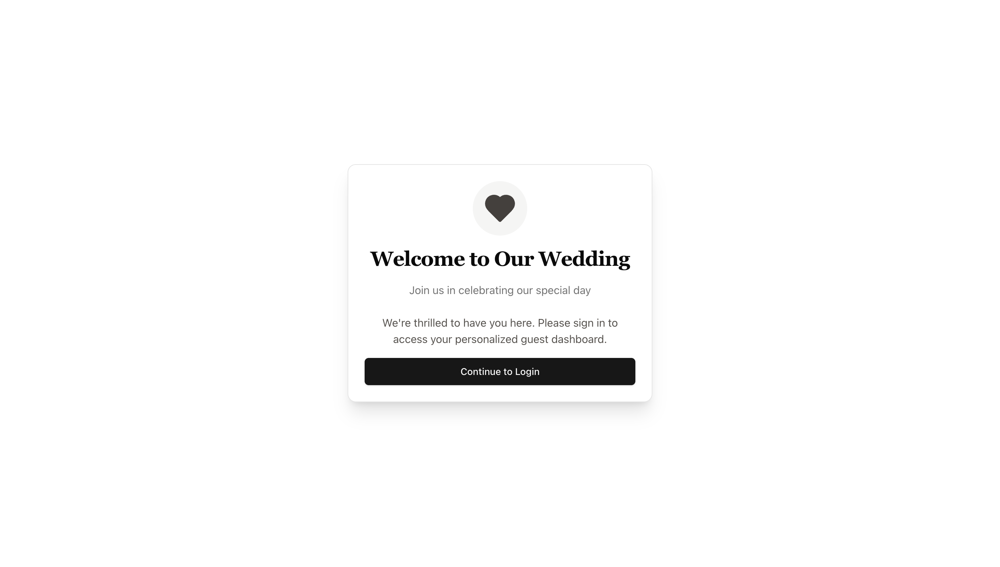
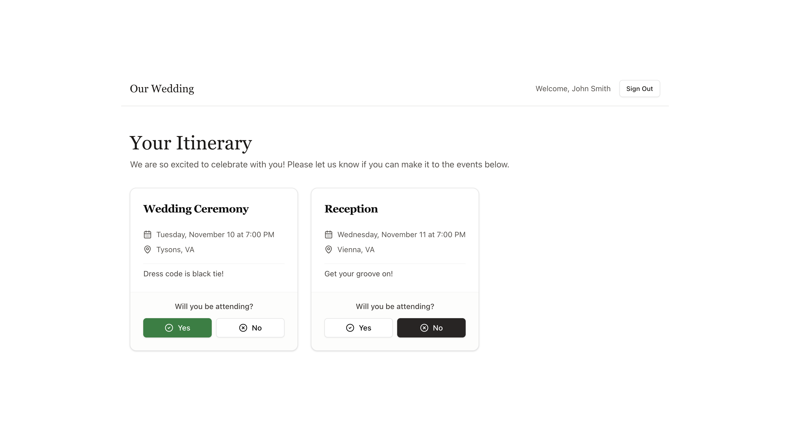
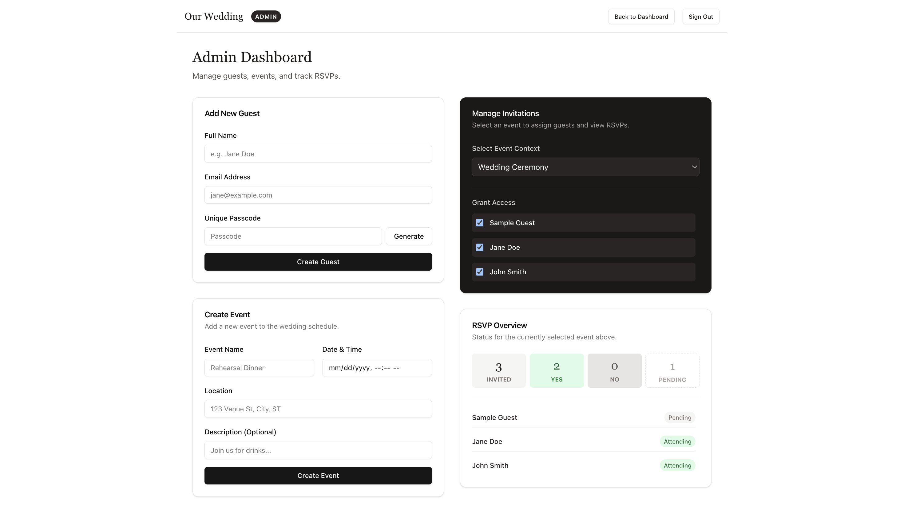

# Wedding Portal

A full-stack RSVP management portal for weddings. Couples can manage guests and events, while guests can log in and RSVP to the events they've been invited to.



---

## Features

### For Guests
- Personalized login with email + passcode
- View events you've been invited to (date, time, location, description)
- RSVP attending or declining for each event
- View your full itinerary at a glance



### For Admins
- Add guests and auto-generate their passcodes
- Create wedding events
- Manage which guests are invited to which events
- View RSVP overview: total invited, attending, declined, and pending counts per event



---

## Tech Stack

| Layer | Technology |
|---|---|
| Frontend | [React](https://react.dev/) 18 + [TypeScript](https://www.typescriptlang.org/) |
| Routing | [React Router](https://reactrouter.com/) v7 |
| Build Tool | [Vite](https://vitejs.dev/) |
| Styling | [Tailwind CSS](https://tailwindcss.com/) + [shadcn/ui](https://ui.shadcn.com/) |
| UI Primitives | [Radix UI](https://www.radix-ui.com/) |
| Icons | [Lucide React](https://lucide.dev/) |
| Forms | [React Hook Form](https://react-hook-form.com/) + [Zod](https://zod.dev/) |
| Charts | [Recharts](https://recharts.org/) |
| Backend / DB | [Supabase](https://supabase.com/) (PostgreSQL + Auth + RLS) |
| Notifications | [Sonner](https://sonner.emilkowal.ski/) |

---

## Project Structure

```
wedding-portal/
├── src/
│   ├── pages/
│   │   ├── Welcome.tsx          # Landing page
│   │   ├── Login.tsx            # Guest login (email + passcode)
│   │   ├── Dashboard.tsx        # Guest RSVP portal
│   │   └── AdminDashboard.tsx   # Admin management
│   ├── components/
│   │   ├── ui/                  # shadcn/ui components
│   │   └── admin/
│   │       ├── AddGuestForm.tsx
│   │       ├── CreateEventForm.tsx
│   │       ├── ManageInvitations.tsx
│   │       └── RSVPOverview.tsx
│   ├── lib/
│   │   ├── supabase.ts          # Supabase client (anon key, RLS enforced)
│   │   └── supabase-admin.ts    # Supabase admin client (service role key)
│   ├── hooks/
│   │   └── use-toast.ts
│   ├── types/
│   │   └── admin.ts
│   └── App.tsx                  # Route definitions
├── supabase/
│   └── migrations/              # Database schema SQL
├── tailwind.config.js
├── vite.config.ts
└── components.json              # shadcn/ui config
```

---

## Database Schema

The app uses Supabase (PostgreSQL) with the following tables:

- **guests** — Guest profiles with `full_name`, `email`, `passcode`, and `is_admin` flag
- **events** — Wedding events with `name`, `date`, `location`, and `description`
- **access** — Many-to-many join table granting guests access to specific events
- **rsvps** — Guest responses (`attending` or `declined`) per event
- **media** — Guest-uploaded photos linked to their profile

Row-Level Security (RLS) policies ensure guests can only view/edit their own data.

---

## Getting Started

### Prerequisites

- [Node.js](https://nodejs.org/) v18+
- A [Supabase](https://supabase.com/) project

### 1. Clone the repo

```bash
git clone https://github.com/your-username/wedding-portal.git
cd wedding-portal
```

### 2. Install dependencies

```bash
npm install
```

### 3. Configure environment variables

Create a `.env` file in the project root:

```env
VITE_SUPABASE_URL=https://your-project-id.supabase.co
VITE_SUPABASE_ANON_KEY=your-anon-public-key
VITE_SUPABASE_SERVICE_ROLE_KEY=your-service-role-key
```

You can find these values in your Supabase project under **Settings → API**.

> **Note:** The service role key bypasses Row-Level Security and should never be exposed in production. For a production deployment, admin operations should be moved to a secure backend.

### 4. Apply database migrations

In your Supabase dashboard, open the **SQL Editor** and run the migration file:

```
supabase/migrations/20260317175617_create_wedding_schema.sql
```

Or use the [Supabase CLI](https://supabase.com/docs/guides/cli):

```bash
supabase db push
```

### 5. Run the development server

```bash
npm run dev
```

The app will be available at `http://localhost:5173`.

---

## Available Scripts

| Command | Description |
|---|---|
| `npm run dev` | Start the Vite development server |
| `npm run build` | Type-check and build for production |
| `npm run preview` | Preview the production build locally |
| `npm run lint` | Run ESLint |
| `npm run typecheck` | Run TypeScript type checking |

---

## Authentication Flow

1. Admin creates a guest via the admin dashboard — a passcode is auto-generated
2. Guest navigates to `/login` and enters their email + passcode
3. Supabase Auth validates credentials and creates a session
4. The session determines which events the guest has access to (via the `access` table)
5. Admins are identified by the `is_admin` flag on their guest record and are redirected to `/admin-dashboard`

---

## Deployment

Build the app for production:

```bash
npm run build
```

The output in `dist/` can be deployed to any static hosting provider (Vercel, Netlify, Cloudflare Pages, etc.).

Make sure to set the environment variables (`VITE_SUPABASE_URL`, `VITE_SUPABASE_ANON_KEY`, `VITE_SUPABASE_SERVICE_ROLE_KEY`) in your hosting provider's dashboard.
